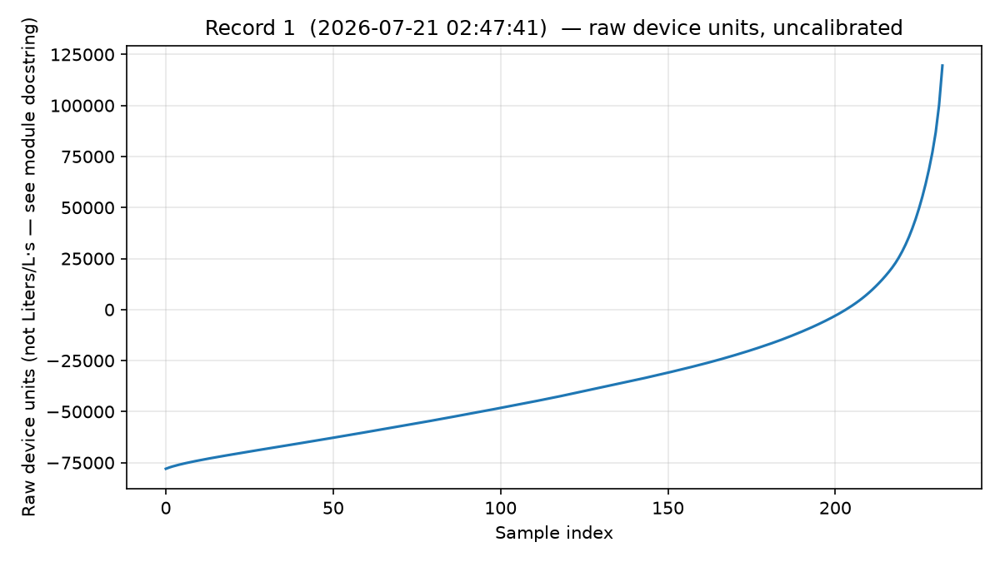
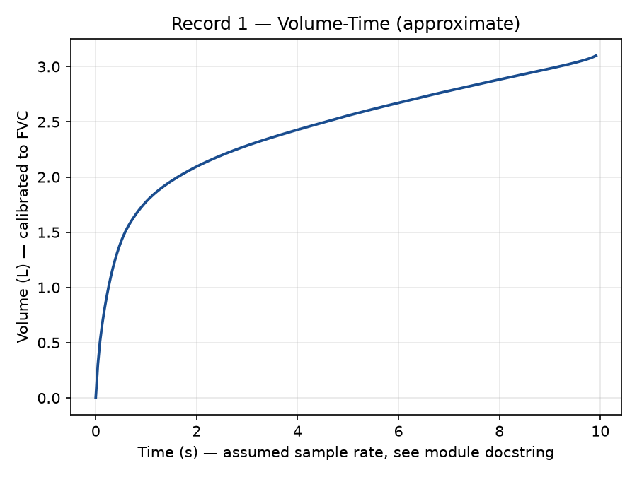
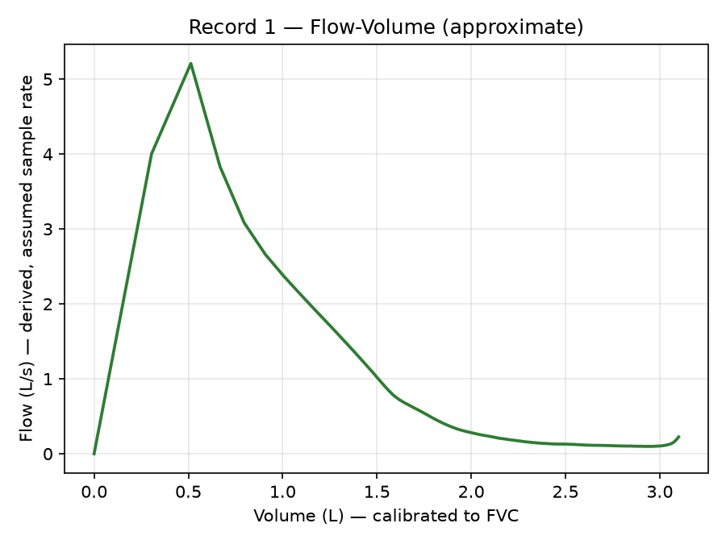

<!-- TODO: replace this section with a real hero screenshot or GIF of the kiosk UI -->
# Contec SP10 Spirometer SDK (Python, USB HID)

**A drop-in Python SDK for the Contec SP10 USB spirometer** — run a full
blow test end-to-end and get back clinical-grade metrics (FVC, FEV1, PEF,
FEV1/FVC, FEF25-75/25/50/75) plus calibrated curve plots, without touching
an undocumented USB protocol yourself.

Built for developers integrating the **Contec SP10 spirometer** (USB HID,
VID `28E9` / PID `0151`) into kiosks, EMR/EHR systems, or standalone
pulmonary function test (PFT) apps on Windows.

> Professional / research integration tool. Not FDA-cleared, CE-marked, or
> otherwise certified as a standalone diagnostic device in any
> jurisdiction. Independent integration — **not affiliated with or endorsed
> by Contec Medical Systems.**

---

## What it does

- Runs a complete spirometry test cycle with one call — drain stale
  backlog, blow countdown, processing wait, single retrieval pull — and
  returns a clear success / invalid-effort / no-blow / error outcome.
- Parses the device's full clinical metric set: FVC, FEV1, PEF, FEV1/FVC,
  FEF25-75, FEF25, FEF50, FEF75.
- Automatically rejects physiologically implausible efforts before they're
  ever reported as good data.
- Renders calibrated Volume-Time and Flow-Volume curves, matching the
  shapes shown on the device's own screen.
- Ships with a full reference kiosk UI (Tkinter) showing the exact
  integration pattern for a GUI front-end.

## Example output

<!-- TODO: swap for higher-res / annotated screenshots -->

| Raw curve | Volume-Time | Flow-Volume |
|---|---|---|
|  |  |  |

<!-- TODO: embed a short demo video/GIF of a live test run here -->

## Integration pattern

A taste of the API — full docs come with the SDK download.

```python
import spirometer

if not spirometer.is_connected():
    print("Connect the SP10 first.")
else:
    result = spirometer.run_test(status_cb=print)   # blocks ~20-25s
    if result.outcome is spirometer.TestOutcome.SUCCESS:
        print(result.record["metrics"])              # FVC, FEV1, PEF, ...
```

## Get the SDK

This repository is a showcase only — it contains **no source code** and
does not include the vendor DLLs required to talk to the device. The full
SDK (source + bundled DataTraffic.dll/hidusblib.dll + docs + sample data)
is available as a one-time purchase:

**[PAYMENT LINK PLACEHOLDER — Gumroad/LemonSqueezy link goes here]**

## Contact

Questions, licensing, or integration help: **navneetkumar2708@gmail.com**

---

**Keywords:** Contec SP10, SP10 spirometer, Contec spirometer SDK, USB
spirometer Python, spirometry software Windows, pulmonary function test
(PFT) software, FVC FEV1 PEF SDK, flow-volume loop, volume-time curve, USB
HID medical device integration, VID 28E9 PID 0151.
